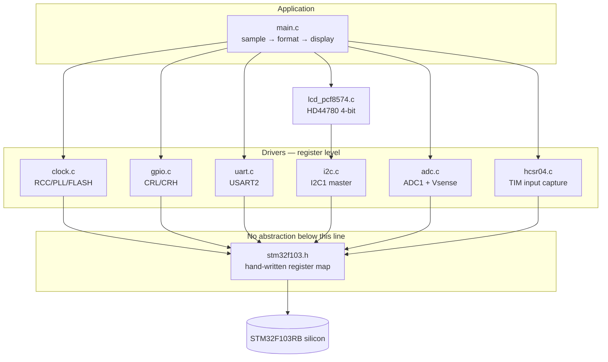

# STM32F103RB — Bare-Metal Register-Level Drivers

Peripheral drivers for the STM32F103RB written directly against the registers.
No HAL, no LL, no CubeMX, no CMSIS headers — the register map in
`include/stm32f103.h` is hand-written from RM0008.

**Board:** ST NUCLEO-F103RB · Cortex-M3 @ 72 MHz · 128 KB flash · 20 KB SRAM

[](https://github.com/usman-aslam-dev/stm32f103-baremetal-drivers/actions)

---

## Zusammenfassung (DE)

Peripherietreiber für den STM32F103RB, direkt auf Registerebene in C
implementiert — ohne HAL, LL oder CubeMX. Enthalten sind Taktkonfiguration
(72 MHz via PLL), GPIO nach dem CRL/CRH-Modell der F1-Serie, USART2, ein
vollständiger I²C-Master mit Fehlerbehandlung und Bus-Recovery, ADC1 mit
internem Temperatursensor sowie Timer-Input-Capture für den HC-SR04.
Die Treiberlogik wird durch Host-Unit-Tests über simulierte Registerbänke
abgedeckt (34 Prüfungen). Grenzen der Verifikation sind unten dokumentiert.

---

## Why this exists

Anyone can call `HAL_I2C_Master_Transmit()`. This repo is the answer to the
follow-up question: *what does it actually do to the peripheral, and what
happens when the bus misbehaves?*

Every driver here was written from the reference manual, and every non-obvious
line carries a comment explaining the hardware reason for it — not what the
code does, but why the silicon requires it.

## What's implemented

| Module | File | What it covers |
|---|---|---|
| Clock tree | `src/clock.c` | HSE bypass → PLL ×9 → 72 MHz, flash wait states, bus prescalers |
| GPIO | `src/gpio.c` | F1 CRL/CRH nibble model, atomic BSRR access |
| USART2 | `src/uart.c` | BRR mantissa/fraction, ORE recovery, ST-LINK VCP |
| I²C1 master | `src/i2c.c` | Full TX/RX state machines, N=1/N=2 special cases, bus recovery |
| ADC1 | `src/adc.c` | Calibration, internal temp sensor, VREFINT → true VDDA |
| LCD | `src/lcd_pcf8574.c` | PCF8574 I²C expander → HD44780 4-bit protocol |
| HC-SR04 | `src/hcsr04.c` | TIM input capture, µs resolution, echo timeout |
| Timing | `src/systick.c`, `src/dwt_delay.c` | 1 ms SysTick, DWT cycle-counter µs delays |
| Startup | `src/startup_stm32f103rb.c` | Vector table, `.data`/`.bss` init, no libc startup |

## Architecture



## Build

```bash
cmake -S . -B build -DCMAKE_TOOLCHAIN_FILE=cmake/arm-none-eabi.cmake
cmake --build build
```

Flash:
```bash
openocd -f interface/stlink.cfg -f target/stm32f1x.cfg \
        -c "program build/stm32f103_baremetal.elf verify reset exit"
```

Console: `/dev/ttyACM0` @ 115200 8N1 (ST-LINK VCP, no extra wiring).

## Host unit tests

The pure logic — baud divisors, I²C timing arithmetic, ADC conversion maths,
HC-SR04 distance — is tested on x86 with no board attached. Peripheral base
addresses are redirected to a RAM struct (`test/support/fake_regs.c`), so
register writes can be asserted directly.

```bash
cd test && make
# 34 checks, 0 failures
```

## Measured results

Build of `main.c` + all drivers, `arm-none-eabi-gcc 13.2`, `-Og`:

| Section | Bytes | % of device |
|---|---|---|
| `.text` (flash) | 2 960 | 2.3 % of 128 KB |
| `.data` (RAM) | 4 | — |
| `.bss` (RAM) | 1 036 | 5.1 % of 20 KB |
| **Total RAM** | **1 040** | **5.1 %** |

For comparison, the same functionality built on ST's HAL typically lands
around 12–18 KB of flash. That difference is the point of the exercise.

## Design decisions worth defending

**HSE in bypass mode.** The Nucleo has no crystal populated. HSE is fed from
the ST-LINK's MCO pin as an 8 MHz square wave, so `RCC_CR.HSEBYP` must be set
before `HSEON`. Skip it and `HSERDY` never asserts — the single most common
bring-up failure on this board.

**Flash wait states before the clock, never after.** `FLASH_ACR.LATENCY = 2`
is programmed while still running at 8 MHz. Raise the clock first and the core
fetches faster than the flash can answer, giving a HardFault before `main()`.

**BSRR, never read-modify-write on ODR.** `ODR |= (1<<5)` is three
instructions and not atomic; an interrupt landing mid-sequence corrupts an
unrelated pin. `BSRR` is a single atomic store.

**I²C N=1 and N=2 are separate code paths.** RM0008's master-receiver
flowchart requires different ACK/STOP ordering for one and two byte reads.
Using the general N>2 path clocks an extra byte out of the slave.

**Bounded spins everywhere.** Every `while (!(SR & FLAG))` has a spin limit
and returns a timeout code. A dead bus produces an error, not a hang.

## Limitations — what this does *not* prove

Stated plainly, because a reviewer will work it out anyway:

- **No oscilloscope or logic analyser was used.** Signal integrity, actual edge
  timing and I²C rise times are unverified. Correctness was established from
  the reference manual, host tests and observed behaviour.
- **The internal temperature sensor is ±45 °C absolute, uncalibrated.**
  `V25` and `Avg_Slope` have wide production tolerances. Readings are useful
  for *trends*, not absolute temperature. VREFINT is used to compute true VDDA,
  which removes supply-voltage error but not the sensor tolerance.
- **No dedicated I²C sensor was available**, so the I²C master is exercised
  against the PCF8574 LCD backpack. The master state machine is complete; what
  is missing is experience with a sensor's register map.
- **Host tests cover logic, not silicon.** A fake register bank proves the
  driver writes the values it intends to. It cannot prove the peripheral
  responds as documented.

## Licence

MIT — see [LICENSE](LICENSE).
